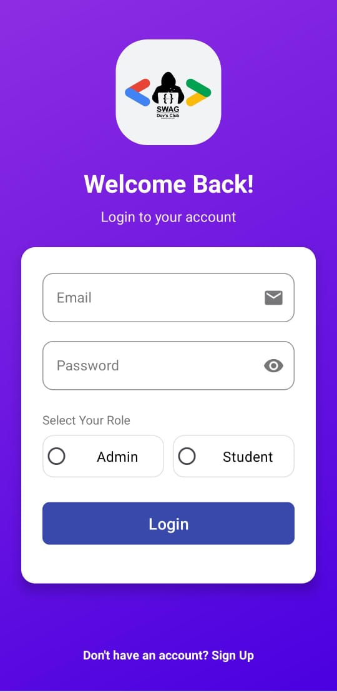

# SWAG_BRAIN 🧠
> An intelligent quiz application for educational assessment and progress tracking

## 📱 Overview

SWAG_BRAIN is an Android application designed to revolutionize how educators assess student knowledge and track academic progress. The app provides a dual-interface system where students can take quizzes while administrators can create assessments and monitor performance in real-time.

✨ Key Features

- **Dual User Interface**: Separate login systems for students and administrators
- **Quiz Creation Dashboard**: Admins can easily create and customize quizzes
- **Real-time Progress Tracking**: Monitor individual and group performance metrics
- **Performance Analytics**: Visualized student progress data
- **PDF Export Functionality**: Save and share student progress reports
- **Secure Authentication**: Protected access to sensitive educational data
- **Intuitive User Experience**: Simple navigation for both students and administrators
- **Cloud Synchronization**: Real-time data syncing across devices with Firebase

## 🚀 Getting Started

### Prerequisites

- Android device or emulator running Android 7.0 (Nougat) or higher
- Minimum 2GB RAM recommended
- At least 50MB of free storage space
- Internet connection for cloud synchronization

## 👩‍🏫 For Administrators

Admin Features Guide

1. **Login**: Access the admin dashboard using your credentials
2. **Create Quiz**: 
   - Tap the "+" button on the dashboard
   - Add quiz title, description, and time limit
   - Create questions with multiple-choice or text answers
   - Save and publish to make available for students
3. **Monitor Progress**:
   - View real-time student performance metrics
   - Filter results by class, date, or specific quiz
   - Analyze performance trends through visual graphs
4. **Export Reports**:
   - Select students or classes for reporting
   - Choose report parameters and date ranges
   - Generate and save professional PDF reports
   - Share via email or other applications

## 👨‍🎓 For Students

Student Features Guide

1. **Login**: Enter your student credentials to access your personalized dashboard
2. **Take Quiz**:
   - Select from available quizzes
   - Read instructions and time limits
   - Submit answers within the allocated time
3. **View Results**:
   - Access immediate feedback after quiz completion
   - Review correct answers and explanations
   - Track your progress over time with performance graphs
4. **Practice Mode**:
   - Retry previously taken quizzes to improve scores
   - Access study materials related to quiz topics

## 🔧 Technical Architecture

SWAG_BRAIN is built using:

- **Language**: Java
- **Platform**: Android SDK
- **Database**: Firebase Firestore for real-time cloud database
- **Authentication**: Firebase Authentication
- **Cloud Storage**: Firebase Storage for media files
- **UI Components**: Material Design

## 🔥 Firebase Integration

SWAG_BRAIN leverages Firebase for a seamless cloud experience:

- **Firestore Database**: Stores all quiz data, user profiles, and progress metrics
- **Real-time Updates**: Instantly sync quiz results and admin changes
- **User Authentication**: Secure login for both students and administrators
- **Cloud Functions**: Automated report generation and notifications
- **Analytics**: Track app usage and performance metrics

## 📊 What Makes SWAG_BRAIN Unique

- **Comprehensive Progress Tracking**: Unlike other quiz apps, SWAG_BRAIN provides detailed analytics on student performance
- **PDF Export Functionality**: Generate professional reports with just a few taps
- **Dual Interface System**: Carefully designed separate experiences for both educators and students
- **Cloud-Based Architecture**: Real-time synchronization across all devices
- **Offline Capability**: Continue using core features even without internet connection

## 📸 Screenshots

 &nbsp;&nbsp;&nbsp;&nbsp;
 &nbsp;&nbsp;&nbsp;&nbsp;
 &nbsp;&nbsp;&nbsp;&nbsp;
 &nbsp;&nbsp;&nbsp;&nbsp;
 &nbsp;&nbsp;&nbsp;&nbsp;
 &nbsp;&nbsp;&nbsp;&nbsp;
 &nbsp;&nbsp;&nbsp;&nbsp;
 &nbsp;&nbsp;&nbsp;&nbsp;

## 📞 Contact

Project Creator - Samruddhi Rahegaonkar and Gouri Pawar.

Project Link: [[https://github.com/yourusername/swagbrain](https://github.com/yourusername/swagbrain)](https://github.com/Gouri-Pawar/SWAG_APP)

---

Made with ❤️ by SWAG Team

© 2025 SWAG_BRAIN

